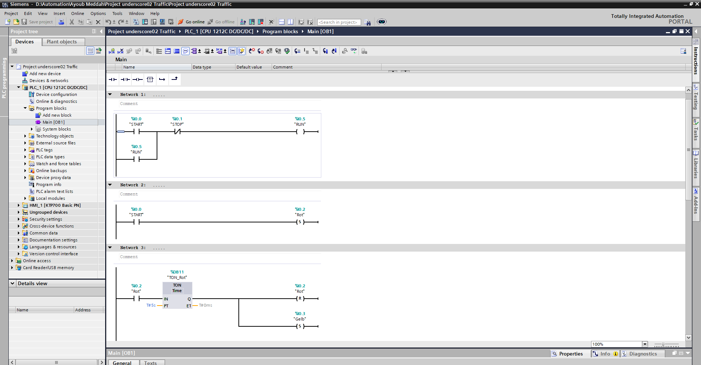
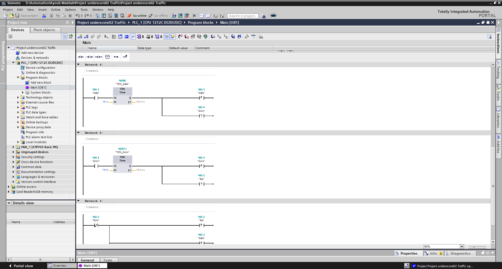
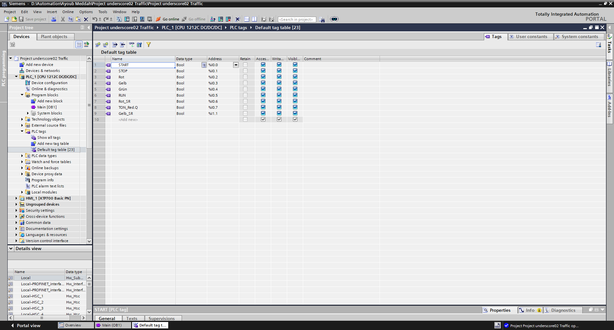
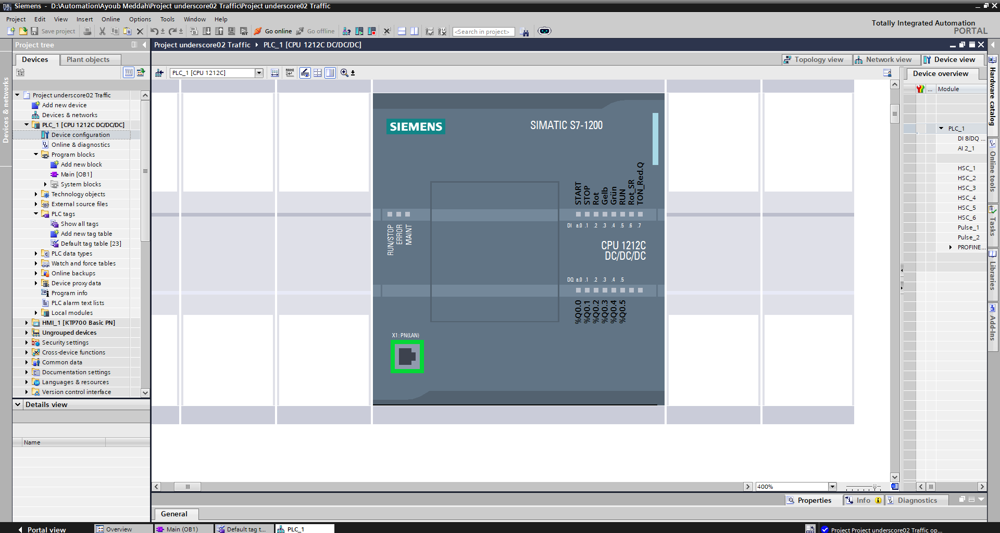
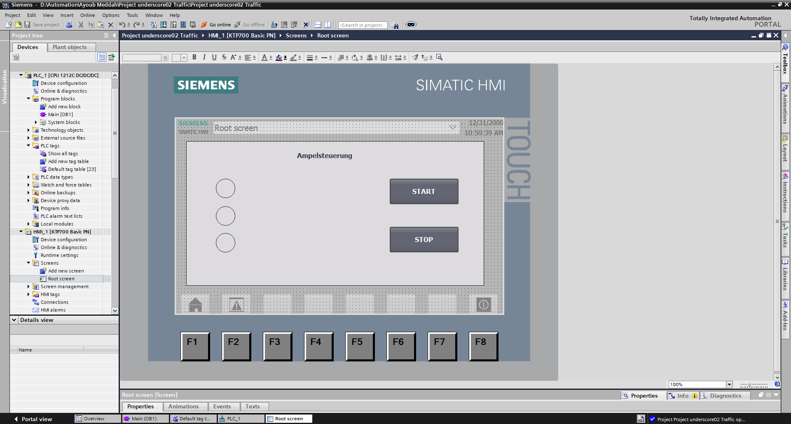

# s7-1200-verkehrsampelsteuerung

Dieses Projekt habe ich erstellt, um eine automatische Verkehrsampel zu entwickeln. Die Ampel steuert den Verkehrsfluss durch einen festen Wechsel zwischen den Signalphasen Rot, Gelb und Grün. Ziel ist ein sicherer und geordneter Verkehrsablauf.

---

## Verwendete Software und Hardware

- Siemens TIA Portal V17
- Siemens S7-1200 CPU 1212C DC/DC/DC
- KTP700 Basic PN
- Ladder Logic (LAD)

---

## Ladder Logic

Die Ampel wird über einen Start- und Stopptaster gesteuert. Nach dem Start beginnt der automatische Ablauf mit der roten Phase. Mithilfe von Timern wechseln die Signalphasen nacheinander von Rot zu Gelb, anschließend zu Grün und danach wieder zu Rot. Der Zyklus wird kontinuierlich wiederholt, bis die Anlage gestoppt wird.

### Network 1

Start-/Stopp-Schaltung mit Selbsthaltung zur Aktivierung der Ampelsteuerung.

### Network 2–6

Automatischer Wechsel zwischen den Signalphasen Rot, Gelb und Grün mithilfe von Timern sowie Set-/Reset-Anweisungen.

---

## PLC-Tags

START (%I0.0): Startet die Ampelsteuerung.

STOP (%I0.1): Stoppt die Ampelsteuerung.

Rot (%Q0.2): Aktiviert das rote Signal.

Gelb (%Q0.3): Aktiviert das gelbe Signal.

Grün (%Q0.4): Aktiviert das grüne Signal.

RUN (%Q0.5): Zeigt an, dass die Steuerung aktiv ist.

---

## Hardware-Konfiguration

Die Hardware-Konfiguration zeigt die verwendete Siemens S7-1200 CPU und die Gerätekonfiguration des Projekts.

---

## HMI

Über die HMI kann die Ampelsteuerung gestartet und gestoppt werden. Außerdem werden die aktuellen Signalphasen und der Betriebszustand der Anlage angezeigt.

